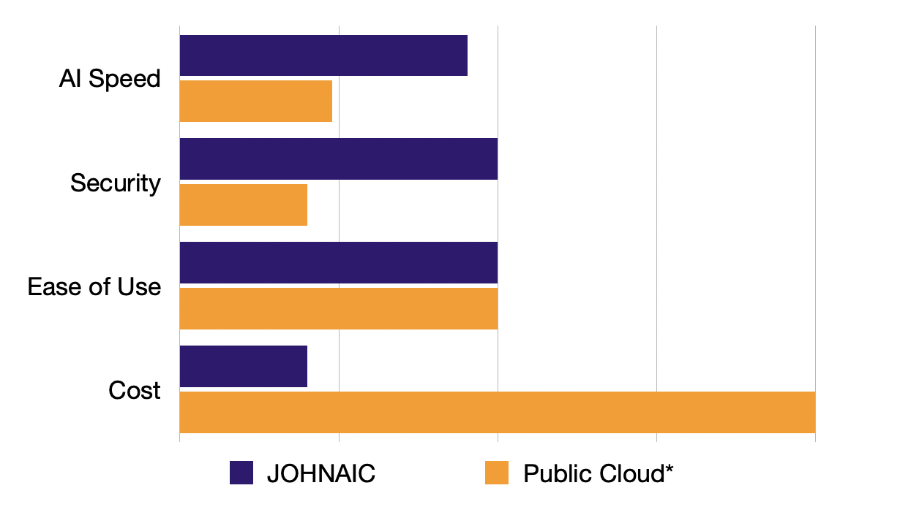

.. Von Neumann AI documentation master file, created by
   sphinx-quickstart on Wed May  8 12:12:23 2024.
   You can adapt this file completely to your liking, but it should at least
   contain the root `toctree` directive.

JOHNAIC: Your Personal AI Server
================================

.. figure:: _static/JOHNAIC.png
   :alt: JOHNAIC, Your Personal AI Server

JOHNAIC is your personal AI server. You can use it to run many AI and software as a service
(SaaS) applications on it and access them from anywhere while still owning your data.

* Plug and play
* Easy to use
* Small footprint
* Cloud-in-a-box
* Free as in freedom
* ₹199,999 + GST

.. figure:: _static/plug-and-play.jpg
   :alt: JOHNAIC, Your Personal AI Server

It doesn't require complicated power supply and works with normal power socket.
Read more about hardware :doc:`here <hardware>`.

Highly Competitive
------------------

When compared with public clouds such as AWS, JOHNAIC is highly competitive both in terms of pricing and features.

Assuming you scale and buy a new server every year, here is how server costs work for you

.. figure:: _static/cost-dynamics.png
   :alt: JOHNAIC, Your Personal AI Server

**Indices and tables**:

.. toctree::
   self
   hardware
   software
   key-information
   blog/index